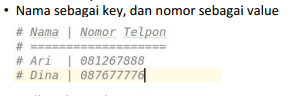

# lab2
# Latihan 1
* Buat Dictionary Daftar Kontak <p>
 <p>
berikut adalah code program yang saya buat :
```python
print("#Nama  | Nomor Telepon")
print("======================")
a={'Ari ':"081267888",'Dina':"087677776"}
for item in a.items():  
    print("#",item[0], "|",item[1])
```
*  Tampilkan kontaknya Ari <p>
berikut adalah code program yang saya buat :
```python
print("Tampilkan kontak Ari: ", a['Ari '])
```
* Tambah kontak baru dengan nama Riko, nomor 087654544 <p>
berikut adalah code program yang saya buat :
```python
print("Tambah kontak baru Riko, nomor 087654544")
a['Riko']="087654544"
```
* Ubah kontak Dina dengan nomor baru 088999776 <P>
berikut adalah code program yang saya buat :
```python
print("Ubah kontak Dina dengan nomor baru 088999776")
a['Dina']="088999776"
```
* Tampilkan semua Nama <p>
berikut adalah code program yang saya buat :
```python
print("Tampilkan semua Nama")
for item in a.items():  
    print(item[0])
```
* Tampilkan semua Nomor<p>
berikut adalah code program yang saya buat :
```python
print("Tampilkan semua Nomor")
for item in a.items():  
    print(item[1])
```
* Tampilkan daftar Nama dan nomornya<p>
berikut adalah code program yang saya buat :
```python
print("Tampilkan daftar nama dan nomornya")
print("#Nama  | Nomor Telepon")
print("======================")
for item in a.items():  
    print("#",item[0], "|",item[1])
```
* Hapus kontak Dina<p>
berikut adalah code program yang saya buat :
```python
print("Hapus kontak Dina")
a['Dina']=""


print("#Nama  | Nomor Telepon")
print("======================")
for item in a.items():  
    print("#",item[0], "|",item[1])
```


