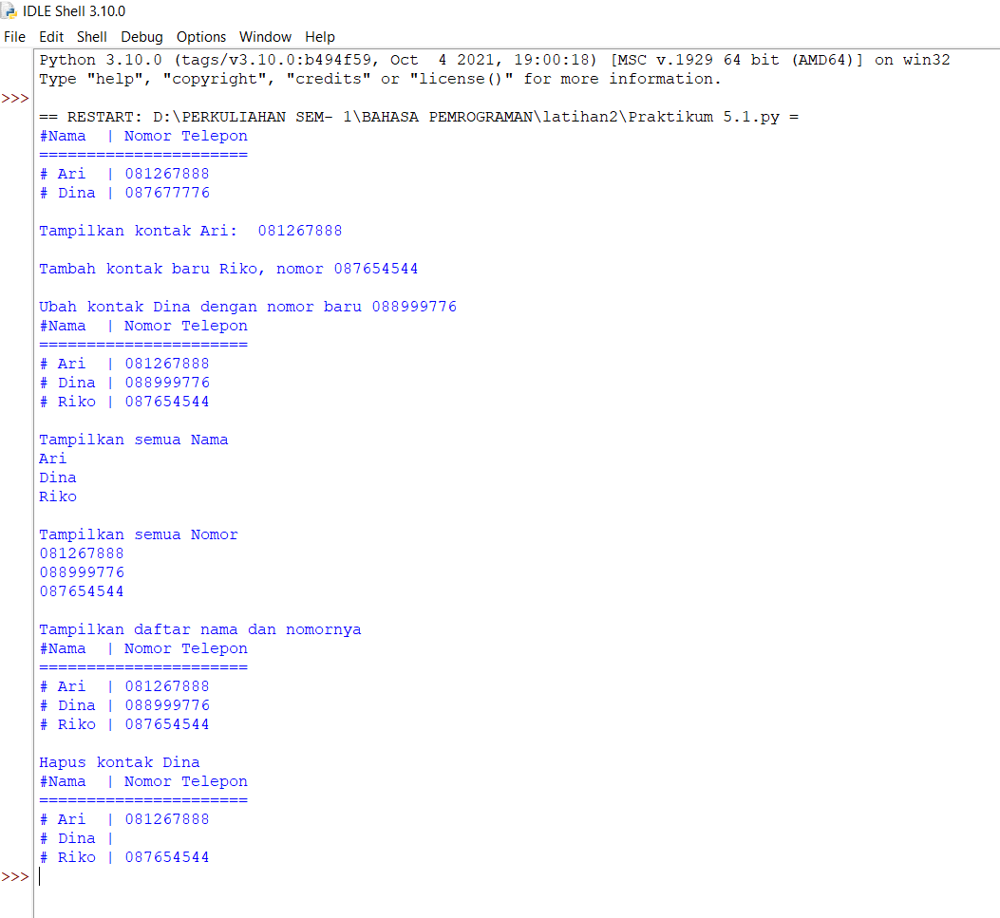

# lab2
# Latihan 1
* Buat Dictionary Daftar Kontak <p>
 <p>
berikut adalah code program yang saya buat :
```python
print("#Nama  | Nomor Telepon")
print("======================")
a={'Ari ':"081267888",'Dina':"087677776"}
for item in a.items():  
    print("#",item[0], "|",item[1])
```
*  Tampilkan kontaknya Ari <p>
berikut adalah code program yang saya buat :
```python
print("Tampilkan kontak Ari: ", a['Ari '])
```
* Tambah kontak baru dengan nama Riko, nomor 087654544 <p>
berikut adalah code program yang saya buat :
```python
print("Tambah kontak baru Riko, nomor 087654544")
a['Riko']="087654544"
```
* Ubah kontak Dina dengan nomor baru 088999776 <P>
berikut adalah code program yang saya buat :
```python
print("Ubah kontak Dina dengan nomor baru 088999776")
a['Dina']="088999776"
```
* Tampilkan semua Nama <p>
berikut adalah code program yang saya buat :
```python
print("Tampilkan semua Nama")
for item in a.items():  
    print(item[0])
```
* Tampilkan semua Nomor<p>
berikut adalah code program yang saya buat :
```python
print("Tampilkan semua Nomor")
for item in a.items():  
    print(item[1])
```
* Tampilkan daftar Nama dan nomornya<p>
berikut adalah code program yang saya buat :
```python
print("Tampilkan daftar nama dan nomornya")
print("#Nama  | Nomor Telepon")
print("======================")
for item in a.items():  
    print("#",item[0], "|",item[1])
```
* Hapus kontak Dina<p>
berikut adalah code program yang saya buat :
```python
print("Hapus kontak Dina")
a['Dina']=""


print("#Nama  | Nomor Telepon")
print("======================")
for item in a.items():  
    print("#",item[0], "|",item[1])
```
### Tampilan program setelah dijalankan

# Tugas Praktikum
### Buat program sederhana yang akan menampilkan daftar nilai mahasiswa, dengan ketentuan :
1. Program dibuat dengan menggunakan Dictionary
2. Tampilkan menu pilihan: (Tambah Data, Ubah Data, Hapus Data, Tampilkan Data, Cari Data)
3. Nilai Akhir diambil dari perhitungan 3 komponen nilai (tugas: 30%,uts: 35%, uas: 35%)
4. Buat flowchart dan penjelasan programnya pada README.md.
### Flowchart program Daftar Nilai Siswa

### Penjelasan
1. ``dataMhs = {}`` Berikut adalah Directory program
2. Gunakan perulangan ``while``
```python
while True:
    c = input("\n(L)ihat, (T)ambah, (U)bah, (C)ari, (H)apus, (K)eluar: ")
```
3. Tambah<p>
Berikut adalah code untuk menambahkan data :
```python
if (c.lower() == 't'):
            print("\n========================================")
            print("             |TAMBAH DATA MAHASISWA|         ")
            print("==========================================")
            nama = input("Masukkan Nama: ")
            #if nama in dataMhs.keys():
            nim = str(input("Masukkan NIM Baru       : "))
            nilaiTugas = int(input("Masukkan Nilai Tugas Baru   : "))
            nilaiUts = int(input("Masukan Nilai UTS Baru   : "))
            nilaiUas =int(input("Masukkan Nilai UAS Baru   : "))
                
            nilaiAkhir = (0.30*nilaiTugas+0.35*nilaiUts+0.35*nilaiUas)
            dataMhs[nama] = nim, nilaiTugas, nilaiUts, nilaiUas, nilaiAkhir
            print("\nData Berhasil di Tambahkan")
```

4. Lihat <p>
```python
elif (c.lower() == 'l'):
            if dataMhs.items():
                print("\n                      DAFTAR NILAI MAHASISWA                    ")
                print("==================================================================")
                print("| No |     Nama     |    NIM    | Tugas |  UTS  |  UAS  |  Akhir |")
                print("==================================================================")
                i = 0
                for x in dataMhs.items():
                    i += 1
                    print("| {6:2} | {0:12s} | {1:9s} | {2:5} | {3:5} | {4:5} | {5:6} |".format(x[0], x[1][0], x[1][1], x[1][2], x[1][3], x[1][4], i))
                    print("==================================================================")
            else:
                print("\n                      DAFTAR NILAI MAHASISWA                    ")
                print("==================================================================")
                print("| No |     Nama     |    NIM    | Tugas |  UTS  |  UAS  |  Akhir |")
                print("==================================================================")
                print("|                          TIDAK ADA DATA!                       |")
                print("==================================================================")
```
5. Ubah <p>
Berikut adalah code untuk mengubah data :
```python
elif (c.lower() == 'u'):
            print("\n=======================")
            print("| EDIT DATA MAHASISWA |")
            print("=======================")
            nama = input("Masukkan Nama: ")
            if nama in dataMhs.keys():
                nim           = input("Masukkan NIM Baru         : ")
                nilaiTugas    = int(input("Masukkan Nilai Tugas Baru : "))
                nilaiUts      = int(input("Masukkan Nilai UTS Baru   : "))
                nilaiUas      = int(input("Masukkan Nilai UAS Baru   : "))
                nilaiAkhir    = (0.30 * nilaiTugas) + (0.35 * nilaiUts) + (0.35 * nilaiUas)
                dataMhs[nama] = nim, nilaiTugas, nilaiUts, nilaiUas, nilaiAkhir
                print("\nData Berhasil Di Update!")
            else:
                print("Data tidak ditemukan!")
```
6. Cari <p>
Berikut adalah code untuk mencari data :
```python
elif (c.lower() == 'c'):
            print("\n=======================")
            print("| CARI DATA MAHASISWA |")
            print("=======================")
            nama = input("Masukan Nama:  ")
            if nama in dataMhs.keys():
                print("\n                   DAFTAR NILAI MAHASISWA                   ")
                print("==============================================================")
                print("|     Nama     |    NIM    | Tugas |  UTS  |  UAS  |  Akhir |")
                print("==============================================================")
                print("| {0:12s} | {1:9s} | {2:5} | {3:5} | {4:5} | {5:6} |".format(nama, nim, nilaiTugas, nilaiUts, nilaiUas, nilaiAkhir))
                print("==============================================================")
            else:
                print("Datanya {0} Tidak Ada ".format(nama))
```
7. Hapus <p>
Berikut adalah code untuk menghapus data :
```python
elif (c.lower() == 'h'):
            nama = input("Masukkan Nama:  ")
            if nama in dataMhs.keys():
                del dataMhs[nama]
                print("Data Telah dihapus!")
            else:
                print("Data Mahasiswa Tidak Ada".format(nama))
```
8. Keluar <p>
Berikut adalah code untuk keluar 
```python
if (c.lower() == 'k'):
        print("\n Intan \n 312110075 \n TI.21.A.2")
        break
```
9. Tampilan Program setelah di Jalankan


